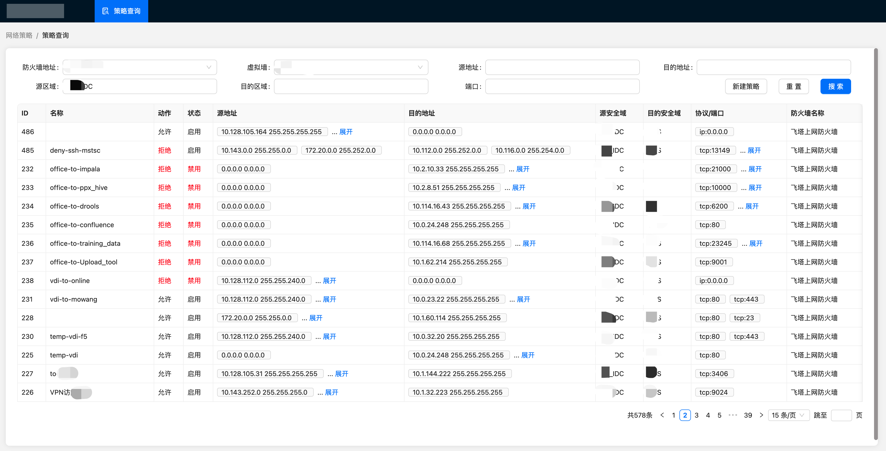
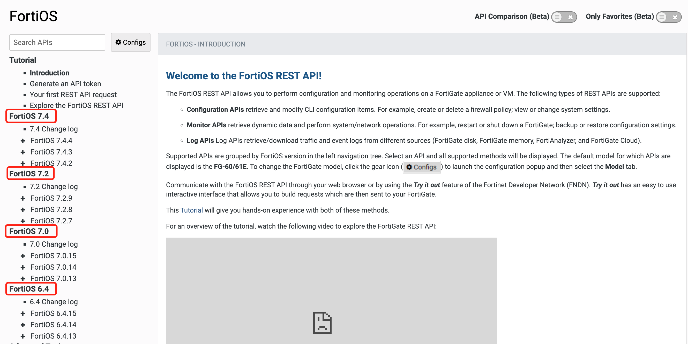
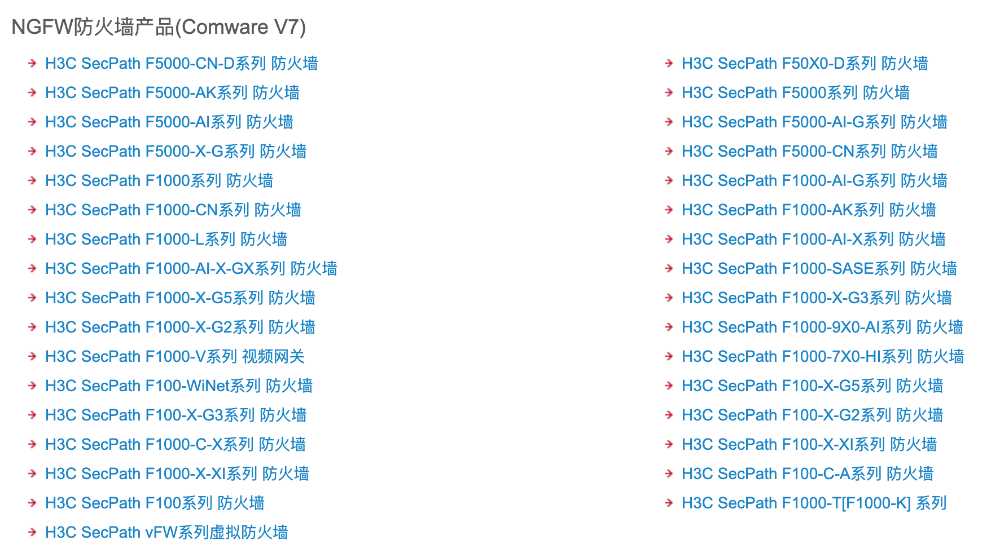

<div align=left>


</div>

<!-- ## 项目文档

[前端插件市场](https://www.antdv.com/docs/vue/introduce-cn/) -->

## 1. 基本介绍

> FirewallPolicyAuto是一个基于 [react](https://react.dev/) 和 [iris](https://github.com/kataras/iris) 开发的前后端分离项目，统一了多种防火墙[fortinet](https://www.fortinet.com/)、[H3C](https://www.h3c.com/cn/Service/Document_Software/Document_Center/IP_Security/)的查询和操作方式，去除常规命令行的操作方式，支持通过简单配置完成页面化防火墙的5元组的策略管理。



#### 防火墙支持版本

- 飞塔防火墙支持版本



- H3C防火墙支持版本



## 2. 使用说明

- [防火墙REST API服务开通](firewall_rest.md)

- [后端服务](service/README.md)

- [前端服务](web/README.md)

## 3. 技术选型

- 前端：用基于 [react](https://react.dev/) 的 [antd](https://www.antdv.com/) 构建基础页面。
- 前端构建：基于 [vite](https://vitejs.dev/) 的新型前端构建工具。
- 后端：用 [Iris](https://github.com/kataras/iris) 快速搭建基础restful风格API。
- 配置文件：使用[viper](https://github.com/spf13/viper) 实现`toml`格式的配置文件。
- 日志：使用 [zap](https://github.com/uber-go/zap) 实现日志记录。

## 4. 目录结构

```
├─docs                    # 一些项目文件  
├─service                 # 后端服务
│ ├─config        
│ │ ├─config.go           # 配置项管理及初始化方法
│ │ ├─config.toml         # 配置文件（如果需要）
│ │ └─default.go          # 默认的配置示例(也可以修改此文件，修改启动配置后使用默认配置)
│ ├─pkg          
│ │ ├─firewall            # 防火墙操作包
│ │ │  ├─dto              # 数据model
│ │ │  ├─fortinet_v1      # 飞塔防火墙API封装v1版本
│ │ │  ├─h3c_v1           # H3C防火墙API封装v1版本
│ │ │  ├─requests         # API请求封装
│ │ │  └─factory.go       # 防火墙api统一入口
│ │ └─logger              # 日志包
│ ├─router             
│ │ ├─v1                  # v1版本路由
│ │ ├─cors.go             # cors插件
│ │ └─router.go           # 路由
│ ├─utils             
│ │ ├─common.go           # 公共方法
│ │ ├─response.go         # 标准化返回
│ │ └─validator.go        # 参数校验包
│ ├─version             
│ │ └─version.go          # 版本号
│ ├─Dockerfile            # dockerfile配置
│ ├─go.mod                # gomod配置
│ ├─go.sum                # gosum
│ ├─main.go               # 入口文件
│ ├─Makefile              # make配置
│ └─README.md             # readme
│ 
├─web                     # 前端服务
│ ├─node_modules          # 依赖包
│ ├─public                # 静态资源
│ ├─src             
│ │ ├─assets              # 静态资源
│ │ ├─context             # 状态管理
│ │ ├─layout              # 布局
│ │ ├─pages               # 页面
│ │ │  └─Policy           # 策略查询
│ │ │     └─index.tsx
│ │ ├─routes              # 路由
│ │ ├─server              # api封装
│ │ │  ├─xxx.ts           # api
│ │ │  └─axios.ts         # axios封装
│ │ └─main.tsx            # 根组件
│ ├─package.json          # 依赖包
│ ├─tsconfig.json         # ts配置
│ ├─eslint.config.js      # eslint配置
│ ├─index.html            # 入口文件
│ └─vite.config.ts        # vite配置
├─firewall_rest.md        # 防火墙开通rest api说明
└─README.md               # 项目readme
```

## 5. 主要功能

- 策略管理：统一`fortinet`和`H3C`的策略管理方式。
- 策略搜索：支持基于策略5元组的条件搜索。
