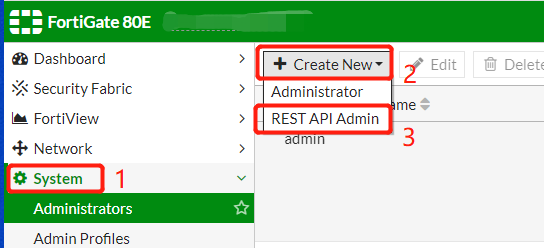
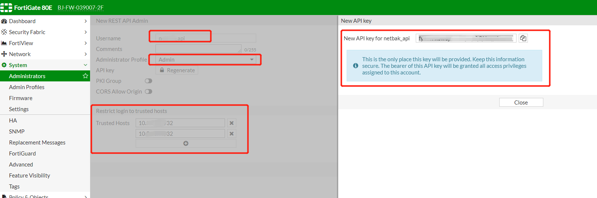

# 防火墙REST API开启
## fortinet firewall (飞塔防火墙)

### step 1: 开启REST API设置


### step 2: 创建用户并获取REST API密钥

```
创建用户：Username 
配置权限：Administrator Profile，（按需授权read/write）权限
配置限源：Trusted Hosts 
获取密钥：New API key for username （注意只能获取一次，保存好!!!）
```



## h3c firewall (H3C防火墙)

### step 1: ssh登录防火墙
```shell
ssh -p xx username@ip
```

### step 2: 进入系统视图
```shell
system-view
```

> 根据需要选择http或者https

### step 3: 配置基于 HTTP/HTTPS 的 REST API 功能的端口号
```shell
# http
restful http port port-number
# https
restful https port port-number
```

### step 4: 开启基于 HTTP/HTTPS 的 REST API 功能
```shell
# http
restful http enable
# https
restful https enable
```